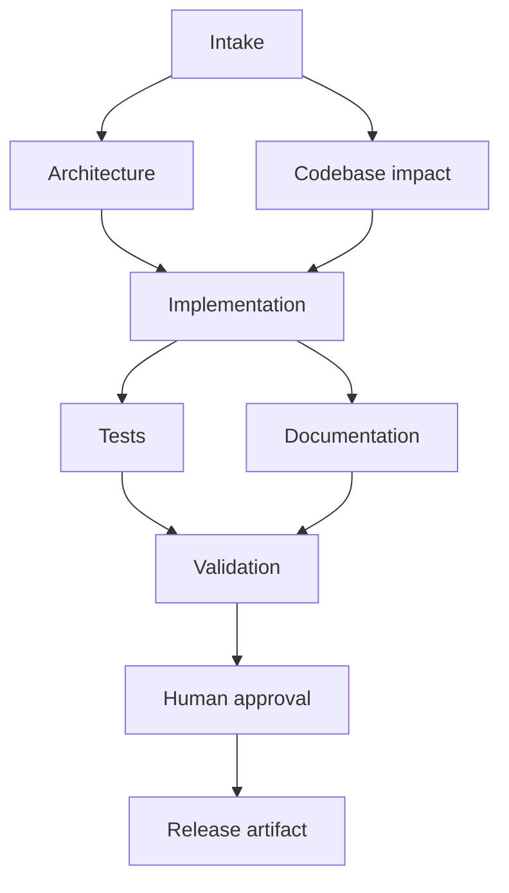

# Agentic software engineering prototype: URL shortener

This is a runnable, standard-library Python submission for the take-home design exercise. It contains a URL shortener and a separate SDLC orchestrator that analyzes requirements, maps impacted modules, stages code, validates it, writes documents, and gates release. No API key or paid service is required.

## Quick start

Python 3.10+ is required. From this folder:

```bash
python -m unittest discover -s tests -v
python orchestrator.py all
python shortener.py
```

The first command tests the service and orchestrator. The second creates `runs/greenfield`, `runs/brownfield`, and `runs/ambiguous` with `state.json`, events, summaries and any staged code. The default release result is **blocked pending human approval**. Review the artifacts, then explicitly authorize a local release demonstration:

```bash
python orchestrator.py greenfield --approve
python orchestrator.py brownfield --approve
```

Ambiguous input stays blocked even with `--approve`. The run asks what “sometime later” means rather than guessing an expiry policy.

In another terminal, try the live API:

```bash
curl -i -X POST http://127.0.0.1:8000/api/links -H 'Content-Type: application/json' -d '{"url":"https://example.org/docs","code":"demo123"}'
curl -i http://127.0.0.1:8000/demo123
curl http://127.0.0.1:8000/api/links/demo123/stats
```

`SHORTENER_DB` changes the SQLite file path, while `SHORTENER_HOST` and `SHORTENER_PORT` configure listening. For the brownfield enhancement, run `python runs/brownfield/shortener.py` (set `SHORTENER_DB` to an existing database if desired) and call `DELETE /api/links/demo123`.

## Architecture and control flow



Independent architecture and impact nodes execute in parallel; tests and documentation also execute in parallel after code staging. The dependency graph is explicit in `orchestrator.py`. The coordinator waits at each join and records the node result in `state.json`. Agents are specialized Python executors with bounded file access to the selected run directory. Tests run as a local subprocess with a timeout. Each node retries once, then stops with an audit event; no external system is modified. A changed requirement archives the old output and starts a new run, invalidating downstream decisions.

The service has an HTTP handler and SQLite repository. `POST /api/links` creates a random code or a caller supplied URL-safe code; `GET /{code}` redirects and increments clicks; `GET /api/links/{code}/stats` returns analytics. Codes are unique under the SQLite primary key. A lock serializes writes in the process, and the database persists across restarts. The brownfield scenario stages a separate version that adds deletion; it does not alter the base service.

## Scenarios and evidence

| Scenario | Decomposition and execution | Validation and gate |
| --- | --- | --- |
| Greenfield | Intake, architecture, impact, stage working service, test, document | HTTP integration tests; release waits for review |
| Brownfield | Inspect affected store and handler, stage DELETE endpoint in a copy, test, document | Create/delete/missing-link test; release waits for review |
| Ambiguous | Ask for expiry duration and expired-link behavior; proposal only | No code written; approval withheld until requirements are clarified |

The run directory contains the full decision lineage. `summary.md` captures plan, assumptions, output, and risks. `test-results.txt` records validation. The base service is independently runnable without the orchestrator.

## Engineering decisions, risks, and limits

- Agent roles here are **deterministic executors**, not LLM calls. This makes the demonstration reproducible without credentials and shows controlled autonomy; it does not prove general natural language understanding or general purpose code generation. A production extension would use a structured model output for intake and planning, schema validation, scoped tools, a protected sandbox, and independent review of generated code.
- New output is staged inside a run directory. The approval flag permits only a local release marker; it does not deploy, push to GitHub, or touch production. The CLI operator must actually review the artifacts before using it.
- Unknown URLs and missing codes return errors; HTTP(S) URL validation rejects credentials and control characters. A redirect service can still be abused for phishing or private network destinations. Production needs authentication, abuse detection, rate limits, outbound URL policy, and an appropriate threat model.
- SQLite is suitable for a single host prototype. High traffic needs a shared transactional store, a click-event pipeline, robust metrics and traces, backup/restore, migrations, capacity testing, and a defined consistency model for analytics.
- Safe stop and two-attempt retry are implemented for local node errors. Transactional rollback across third-party systems, durable worker leases, authenticated approvals, supply-chain scanning, and policy enforcement are future work. The demo does not claim production readiness.
- Basic service integration and workflow tests cover creation, redirect, persistence, analytics, duplicate aliases, input rejection, brownfield deletion, DAG ordering, approval gates and ambiguity. Stress tests and security testing remain open.

## Submission and walkthrough

Publish this folder to a public GitHub repository after reviewing the code and running the commands above. Keep `runs/` out of Git by default; for a reviewer-facing demonstration, you can deliberately include sanitized `runs/*/summary.md`, `scenario.md`, `state.json`, and `test-results.txt` while excluding database files. During the walkthrough, start with the DAG, show how the brownfield impact report drives the staged change, then show that the ambiguous request cannot release code. Explain the deterministic agents and production extensions plainly.
